# telegram-knowledge-base

Personal AI memory tool: Telegram → Cloudflare Workers → Cloudflare Queue → Cloud Run → Graphiti/FalkorDB knowledge graph (v2), with Groq reserved for speech-to-text (v4).

`convo_summary.md` (the previous living design doc) has been deleted intentionally — its durable content is folded into this file. Don't recreate it; extend this file instead.

## Hard constraint

**$0/month in recurring service fees.** Every dependency, service tier, or infra choice must fit inside free tiers (Cloudflare Workers/Queues/R2/D1, Groq free tier, Cloud Run scale-to-zero) or be a one-time cost (Raspberry Pi ≈ $60–100 one-time + ~$0.65/mo electricity, the only recurring non-zero line item). Do not introduce a paid service or tier without flagging it explicitly and getting confirmation first. Accepted exception (confirmed 2026-09-11): the OpenAI API for Graphiti, running on OpenAI's data-sharing complimentary tokens — a one-time $5 prepaid credit to reach usage tier 1, auto-recharge off, so overage can never exceed that credit. Graphiti's embeddings (`text-embedding-3-small`) likely fall outside the free tokens and draw fractions of a cent per month from that same credit.

## Architecture



Source: [docs/architecture.mmd](docs/architecture.mmd) — edit the `.mmd` and regenerate with:
```bash
npx -y @mermaid-js/mermaid-cli -i docs/architecture.mmd -o docs/architecture.svg -b transparent
```

### Key architecture decisions and why

| Decision | Reasoning |
|---|---|
| Telegram as the single ingestion channel | Free, natively supports text/voice/video/documents/links in one chat |
| Webhook (not polling) | Telegram pushes Updates as POSTs to one registered URL; Worker never polls |
| Fast ACK + queue | Telegram retries on slow/non-2xx responses → duplicate Updates. Heavy work must be async |
| Cloudflare Worker as receiver | Free (100k req/day), always warm, can't run yt-dlp/ffmpeg (no binaries) but perfect for validate+enqueue |
| Google Cloud Run over Fly.io | Fly.io killed its free tier (2024). Cloud Run has a permanent free tier: 2M requests, ~50 CPU-hours, 360k GiB-sec/month |
| Cloud Run must be push-triggered, NOT polling | Request-based billing = CPU billed only while handling a request. A poll loop forces instance-based (always-on) billing and burns the free tier |
| Home Pi for Instagram fetches (planned, v4) | Instagram flags datacenter IPs and needs a logged-in browser session. YouTube doesn't need it: captions fetch from Cloud Run's IPs (slow, not blocked — spikes/youtube-transcript) |
| Groq for ASR only (planned, v4) | Whisper large-v3-turbo ~216x realtime, free tier covers personal volume (28.8K audio-seconds/day ≈ 8h); local fallback faster-whisper distil-large-v3 int8. Groq is deliberately **not** used for Graphiti: graph ingestion makes several LLM calls per episode and would burn the free tier that ASR and future text tasks need, and Groq's structured-output mode has reported schema-compliance problems that Graphiti's extraction depends on. |
| Graphiti LLM: OpenAI `gpt-4.1-mini` (v2) | Graphiti needs reliable structured output; OpenAI is its default provider, and the Zep paper built its benchmark graphs with `gpt-4o-mini`. Same model in both Graphiti slots (`model` + `small_model` — an unset `small_model` silently falls back to nano), at temperature 0 so reprocessing a job reproduces the same extraction. Runs on OpenAI's data-sharing complimentary tokens (free up to 2.5M tokens/day on mini/nano models) — see the hard-constraint exception. Confirmed in M0 over `gpt-5-nano`, which linked entities to episodes that never mention them. Embeddings: OpenAI `text-embedding-3-small` — Gemini's free tier (100 requests/min, one request per item from Graphiti) ran out mid-test in M0. Details: [docs/design/v2.md](docs/design/v2.md#graphiti-llm-provider). |
| Graphiti + FalkorDB on GCE e2-micro (v2) | FalkorDB over Neo4j: GraphBLAS sparse-matrix internals are faster for global community detection, which we'll run periodically (v4) as a background job to correct Graphiti's local/greedy community assignment drift; Neo4j GDS Leiden is behind the paid tier on AuraDB Free. FalkorDB runs in Docker on a GCE e2-micro (always-free tier) with Container-Optimized OS (~150MB OS + ~150MB FalkorDB, well within 1GB). Graphiti handles standard retrieval; global Leiden (v4) runs via Python igraph on a schedule and writes community labels back. |
| Cloud Run → FalkorDB connectivity via Direct VPC egress (v2) | Serverless VPC Access connector costs ~$5–15/month (minimum 2 underlying VM instances) — violates $0 constraint. Direct VPC egress needs no connector VMs, only per-GB network transfer (free in-zone, ~$0.01/GB cross-zone → fractions of a cent/month, accepted). Deploy with `--vpc-egress private-ranges-only` (`all-traffic` would need paid Cloud NAT for internet access); firewall allows tcp:6379 only from Cloud Run's subnet; FalkorDB password via environment variable. Public IP rejected: Cloud Run's egress ranges are shared by every GCP customer in the region, and Redis would carry the password in plaintext. |
| R2 for file storage | 10GB free, zero egress fees, S3-compatible — Cloud Run talks to it directly with S3 creds, no proxy needed |
| D1 for job tracking | Full SQLite (joins, FKs, transactions); free tier never a real constraint at this volume |
| Delete raw media after graph ingestion (planned) | Transcript is ≈60-90KB/hr vs. large raw audio/video; explicit delete after `saved` + R2 2-day lifecycle rule scoped to `raw-media/` as safety net (`articles/` is kept) |

## Repo layout

- `workers/ingest` — Worker 1 (`kb-ingest`): Telegram webhook receiver, TypeScript/Wrangler
- `workers/forward` — Worker 2 (`kb-forward`): queue consumer, D1 proxy
- `services/orchestrator` — Cloud Run (`kb-orchestrator`): Python/FastAPI processing orchestrator
- `infra/falkordb` — the FalkorDB VM: cloud-init template and runbook (create, verify, query)
- Each has its own README with local dev / deploy instructions — check the relevant one before working in that component.

## Job descriptor schema (queue message)

```js
{
  job_id: string,            // UUID from Worker 1 — D1 primary key + R2 key prefix
  group_id: string | null,   // media_group_id (albums) or generated UUID (multi-URL fan-out)
  chat_id: number,
  message_id: number,        // (chat_id, message_id) used for webhook-retry dedup
  time_received: string,     // ISO 8601
  content_type: "text" | "voice" | "photo" | "video" | "document" | "url",
  text: string,               // only for "text" — inline, Telegram caps at 4,096 chars
  url: string,                // only for "url"
  url_source: "instagram" | "youtube" | "blog" | "x" | "reddit" | "stackexchange" | "github" | "pdf",
  media: { r2_key, mime_type, size_bytes, duration_seconds },  // binary types only
  caption: string             // optional, also carries prose for fanned-out URL jobs
}
```

Rules:
- **Inline vs. R2 split**: text/captions/URLs stay inline (Telegram-capped, safely under the queue's 128KB limit). All binary media goes to R2 first — never base64-inline binary (≈33% size inflation).
- **R2 keys are chosen by us** (e.g. `raw-media/{job_id}.ogg`, `articles/{job_id}.txt` for a blog job's cleaned text), not generated by R2.
- **Multi-URL messages** fan out into N separate jobs sharing a generated `group_id` — for failure isolation, not queue size.
- **Media albums**: each item is its own job; Telegram's `media_group_id` passes through as `group_id` with no buffering/sync logic.
- **URL validation is two-layer**: Layer 1 (Worker 1) rejects by shape (profiles, channels, playlists, comment permalinks); ambiguous cases (e.g. IG `/p/` posts) are resolved at fetch time (Layer 2, on the Pi via yt-dlp metadata).
- **Telegram `getFile` caps native downloads at 20MB** — larger attachments aren't retrievable without self-hosting Telegram's local Bot API server.

## How to work in this repo

Behavioral guidelines to reduce common LLM coding mistakes. They bias toward caution over speed — for trivial tasks, use judgment.

### 1. Think before coding

**Don't assume. Don't hide confusion. Surface tradeoffs.**

- State your assumptions explicitly. If uncertain, ask.
- If multiple interpretations exist, present them — don't pick silently.
- If a simpler approach exists, say so. Push back when warranted.
- If something is unclear, stop. Name what's confusing. Ask.

### 2. Simplicity first

**Minimum code that solves the problem. Nothing speculative.**

- No features beyond what was asked.
- No abstractions for single-use code.
- No "flexibility" or "configurability" that wasn't requested.
- No error handling for impossible scenarios.
- If you write 200 lines and it could be 50, rewrite it.

Ask yourself: "Would a senior engineer say this is overcomplicated?" If yes, simplify.

### 3. Surgical changes

**Touch only what you must. Clean up only your own mess.**

When editing existing code:
- Don't "improve" adjacent code, comments, or formatting.
- Don't refactor things that aren't broken.
- Match existing style, even if you'd do it differently.
- If you notice unrelated dead code, mention it — don't delete it.

When your changes create orphans:
- Remove imports/variables/functions that YOUR changes made unused.
- Don't remove pre-existing dead code unless asked.

The test: every changed line should trace directly to the request.

### 4. Goal-driven execution

**Define success criteria. Loop until verified.**

Transform tasks into verifiable goals:
- "Add validation" → "Write tests for invalid inputs, then make them pass"
- "Fix the bug" → "Write a test that reproduces it, then make it pass"
- "Refactor X" → "Ensure tests pass before and after"

For multi-step tasks, state a brief plan:
```
1. [Step] → verify: [check]
2. [Step] → verify: [check]
3. [Step] → verify: [check]
```

Strong success criteria let you loop independently. Weak criteria ("make it work") require constant clarification.

## Working conventions

- **Tests are real, not mocked infra.** Workers use `vitest` + `@cloudflare/vitest-pool-workers`, which runs inside actual `workerd` — don't replace this with mocked Cloudflare bindings. Run `npm test` in the relevant `workers/*` directory after changes.
- **D1 schema is the single source of truth.** `workers/forward` tests reuse `workers/ingest`'s migrations rather than duplicating schema — keep it that way; don't fork the schema between workers.
- **State machine discipline.** Jobs move through a flat, linear state machine: `received → verified → queued → forwarded → fetching → transcribing → summarizing → indexing → saved`, with `failed` as a terminal branch from any state (+ `error` column). `indexing` = the knowledge-graph write. Live today: text notes (`received → queued → forwarded → indexing → saved`) and URL jobs from sources with a fetcher — blog, YouTube, X, Stack Exchange, GitHub, PDF — and PDF files (`… → forwarded → fetching → summarizing → indexing → saved`; items under 1,500 chars skip `summarizing`); `verified` and `transcribing` are reserved for later versions. Text notes skip `fetching`/`transcribing`/`summarizing`, native media will skip `fetching`. State lives in D1, not the queue message — queue messages are immutable in-flight. No per-source state values (no `fetching_youtube` vs `fetching_blog`) — combine `state` with `content_type`/`url_source` instead. Litmus test for adding a new state: "would I want the bot to tell me it died *there*?" Any code touching job state must validate transitions, not just write a new value — Worker 2's `canTransition` (`workers/forward/src/db.ts`) is the reference: forward-only through that order (skips allowed), `saved` terminal, `failed` enterable from any non-terminal state and re-exitable when a job re-driven from D1 reports progress; anything else is a 409 and the row stays put.
- **No DLQ by design.** Every D1 job row carries enough content (inline column or `r2_key`) to be re-enqueued from D1 alone — this is deliberate, not an oversight. Don't add a dead-letter queue as a fix for delivery failures; fix re-enqueue/dedup logic instead.
- **Secrets stay in Wrangler / environment, never in code or commits.** Cross-service auth uses shared-secret headers (`X-Telegram-Bot-Api-Secret-Token` for Telegram→Worker 1, `X-KB-Secret` for Worker2↔Cloud Run) — preserve this pattern for new internal endpoints. Status posts (Cloud Run → Worker 2) are best-effort: failures are logged but never fail job handling, since D1 state drives retries.
- **Single-user system.** `OWNER_CHAT_ID` allowlisting is intentional, not a placeholder for multi-tenant support — don't generalize it unless asked.
- **Cloud Run stays request-triggered.** Never add a poll loop or background-task pattern that defers work past the response — Cloud Run's CPU guarantee only holds during request processing; deferred work can stall with no terminal state ever written. Hold the request open for the full synchronous pipeline instead (see blog pipeline, ~20-30s).
- **Model/dependency pinning**: pin exact model versions (e.g. `gemini-3.6-flash`, not a `-latest` alias) so behavior can't shift under a rate budget or prompt tuned to one version. A model appearing in a provider's list-models endpoint doesn't mean it's callable for this account — probe with a real request before relying on it.
- **Don't let secrets leak into logs** — e.g. some HTTP client libraries log full request URLs at INFO, and some APIs embed tokens in the URL path; silence or scrub those loggers.

## Before implementing new pipeline stages

Check [ROADMAP.md](ROADMAP.md) for planned versions and open design questions — curation policy in particular is flagged as highest-risk and should be resolved deliberately before building the graph layer, not implicitly via whatever gets coded first.

## Version renaming

When a version number changes (e.g. v3 becomes v2 due to reordering), update every reference in one pass:
- `docs/design/vN.md` — rename the file and update all internal references to the old version number
- `ROADMAP.md` — update the version heading and the design doc link
- `CLAUDE.md` architecture table — update any version numbers in decision rows
- Search for the old version string across the repo (`grep -rn "vN"`) and fix any missed references before closing out the rename

## Design doc format (`docs/design/`)

Every version design doc must open with two sections before any decisions:

1. **What's done** — a brief summary of what the system can do as of the previous version(s). This anchors the doc so it's readable without cross-referencing the whole repo.
2. **What we're building** — a one-paragraph description of what this version adds and why, in plain terms.

Only after those two sections do decisions, infrastructure, and implementation details follow.

## Reference commands

```bash
# yt-dlp audio-only with browser cookies
yt-dlp --cookies-from-browser chrome -f bestaudio -x --audio-format mp3 -o "%(id)s.%(ext)s" "<URL>"

# ffmpeg normalize for ASR
ffmpeg -i in.m4a -ar 16000 -ac 1 -c:a pcm_s16le out.wav

# Telegram webhook registration
https://api.telegram.org/bot<TOKEN>/setWebhook?url=<worker-url>&secret_token=<secret>
```

## Git

Co-Authored-By trailer and PR footer are handled by session-level attribution config — don't duplicate or override it in this file.
